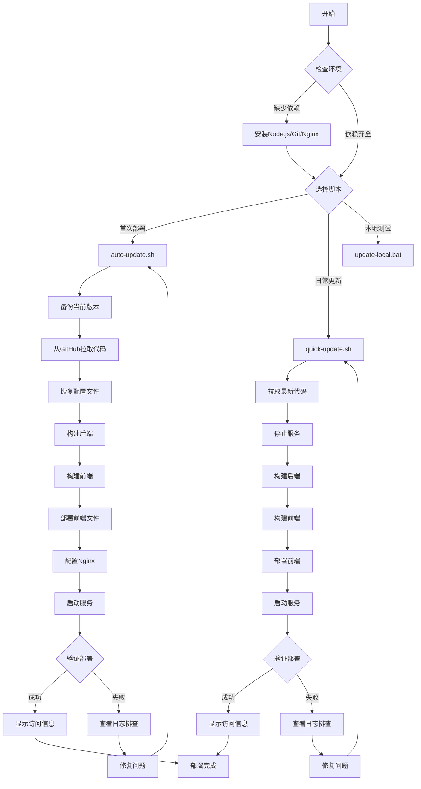
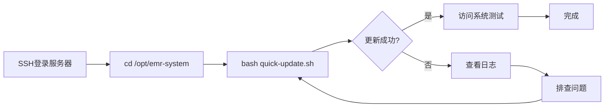
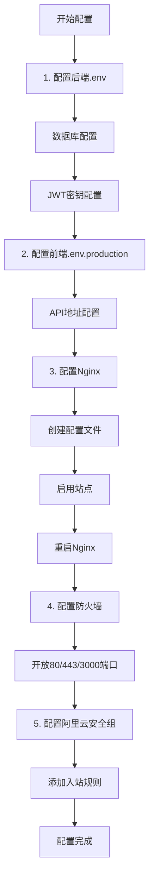
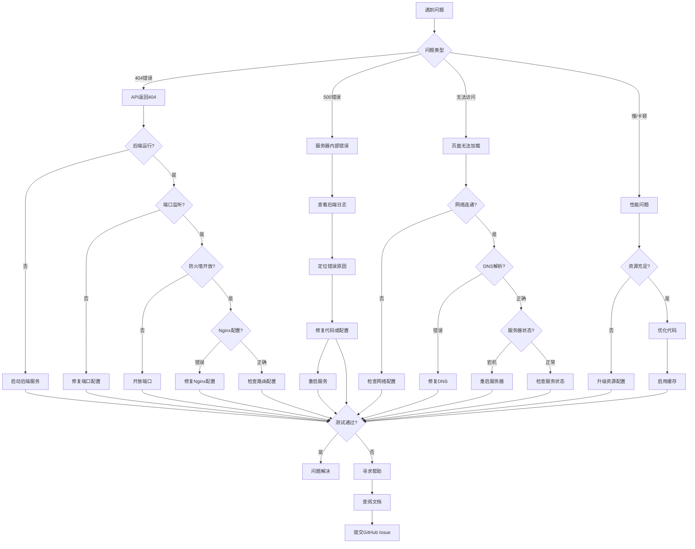
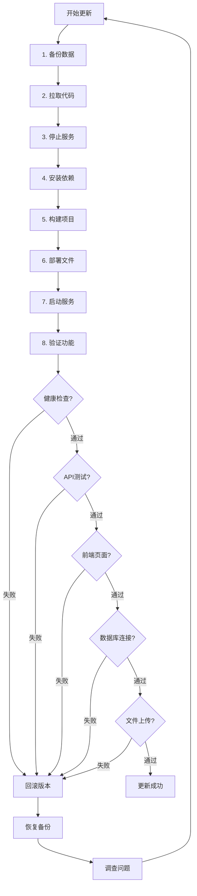
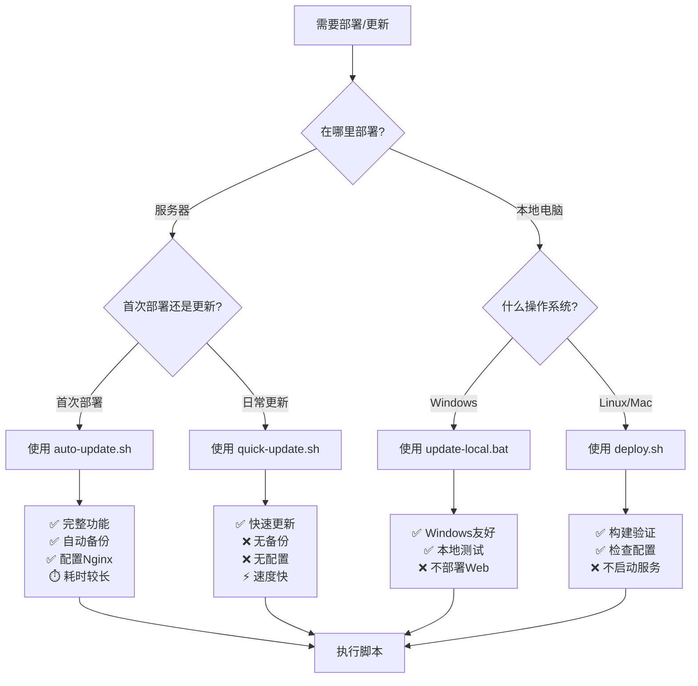
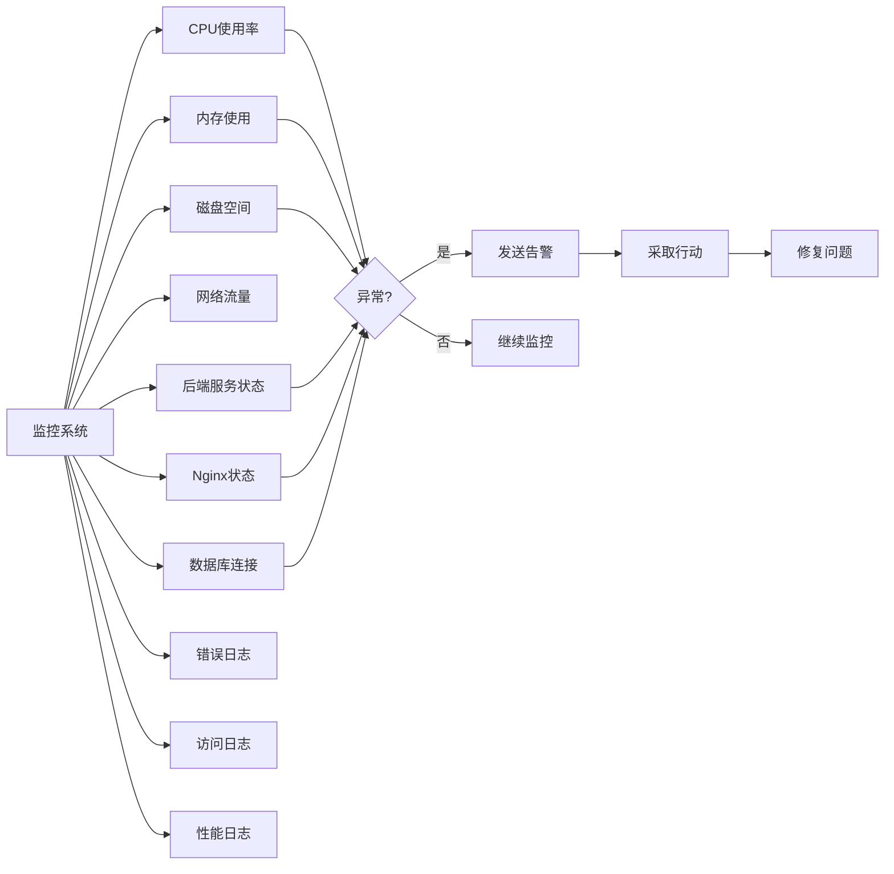

# EMR系统部署流程图

## 📊 完整部署流程



---

## 🔄 日常更新流程



---

## 🏗️ 系统架构

```mermaid
graph TB
    User[用户浏览器] --> Internet[互联网]
    Internet --> Firewall[防火墙/安全组]
    Firewall --> Nginx[Nginx Web服务器]
    
    Nginx -->|静态文件| Frontend[/var/www/html<br/>Vue前端]
    Nginx -->|API代理| Backend[Node.js后端<br/>0.0.0.0:3000]
    
    Backend --> Database[(MySQL数据库<br/>emr_system)]
    Backend --> FileSystem[文件系统<br/>uploads/]
    
    Frontend -->|API请求| Nginx
    Backend -->|JWT认证| Backend
```

---

## 📁 目录结构

```mermaid
graph TD
    Root[/opt/emr-system] --> Backend[emr-backend/]
    Root --> Frontend[emr-frontend/]
    
    Backend --> BackendSrc[src/]
    Backend --> BackendDist[dist/]
    Backend --> BackendEnv[.env]
    Backend --> BackendNode[node_modules/]
    
    Frontend --> FrontendSrc[src/]
    Frontend --> FrontendDist[dist/]
    Frontend --> FrontendEnv[.env.production]
    Frontend --> FrontendNode[node_modules/]
    
    FrontendDist --> Deploy[/var/www/html/]
    
    Root --> Git[.git/]
    Root --> Scripts[部署脚本]
    
    Backup[/opt/emr-backup] --> Backup1[backup-20240101/]
    Backup --> Backup2[backup-20240102/]
```

---

## 🔧 配置流程



---

## 🐛 故障排查流程



---

## 📋 更新检查清单



---

## 🎯 决策树：选择哪个脚本？



---

## 📊 时间估算

| 操作 | 预计时间 | 说明 |
|------|---------|------|
| 首次部署（auto-update.sh） | 5-10分钟 | 包含依赖安装、构建、配置 |
| 日常更新（quick-update.sh） | 1-3分钟 | 仅拉取代码和重新构建 |
| 本地更新（update-local.bat） | 2-5分钟 | Windows环境，不包含部署 |
| 问题排查 | 5-30分钟 | 取决于问题复杂度 |
| 回滚操作 | 2-5分钟 | 从备份恢复 |

---

## 🔍 监控指标



---

**提示**: 可以将这些流程图保存为图片，方便团队参考和培训使用。
