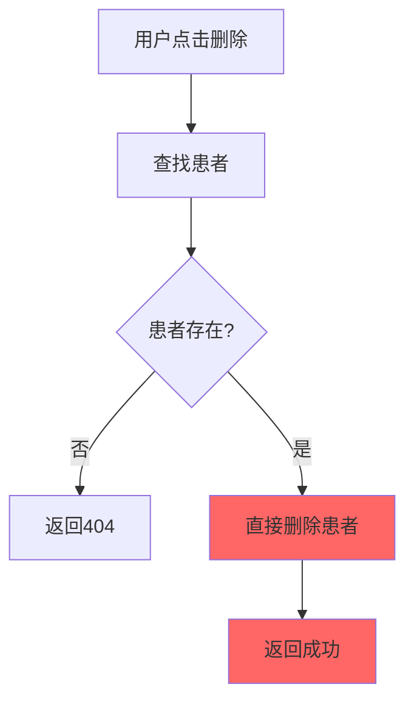
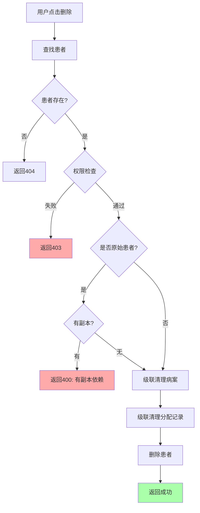

# 患者删除数据隔离修复报告

## ❌ 问题描述

**现象**：在其他用户的患者列表中删除患者后，回到管理员列表时，患者也消失了。

**疑问**：
1. 患者是被真正删除了，还是只是不显示了？
2. 如果是删除了，数据的独立性是否得到保证？
3. 每个用户对病案的操作是否会影响其他用户？

## 🔍 问题分析

### 原有删除逻辑的问题

**文件**: `emr-backend/src/controllers/inpatientController.ts`

**原有代码**（第207-225行）:
```typescript
export const deleteInpatientPatient = async (req: Request, res: Response) => {
  try {
    const { id } = req.params
    const patient = await InpatientPatient.findByPk(id)
    
    if (!patient) {
      return error(res, 404, '患者不存在')
    }
    
    await patient.destroy() // ❌ 直接删除，无权限检查
    res.json({
      code: 200,
      data: null,
      message: '删除成功',
    })
  } catch (err: any) {
    return error(res, 500, err.message)
  }
}
```

**问题**：
1. ❌ **没有权限检查** - 任何用户都可以删除任何患者
2. ❌ **没有副本依赖检查** - 删除原始患者会影响所有副本
3. ❌ **没有级联清理** - 删除患者后，相关的病案和分配记录可能残留

### 教学系统的数据模型

```
管理员创建模板:
  患者A (ID=14, doctorId=4, sourcePatientId=null)
      ↓ 下发
学生B的副本:
  患者A副本 (ID=100, doctorId=11, sourcePatientId=14)
      ↓ 下发  
教师C的副本:
  患者A副本 (ID=101, doctorId=13, sourcePatientId=14)

删除场景:
  ❌ 学生B删除ID=14 → 影响所有人（错误！）
  ✅ 学生B删除ID=100 → 只影响自己（正确）
  ❌ 管理员删除ID=14 → 影响所有副本（需要保护）
```

## ✅ 修复方案

### 核心原则

1. **权限控制** - 只能删除自己创建的患者
2. **副本保护** - 删除原始患者前检查副本依赖
3. **级联清理** - 删除患者时同时清理相关数据

### 修复后的代码

```typescript
export const deleteInpatientPatient = async (req: AuthRequest, res: Response) => {
  try {
    const currentUser = req.user!
    const { id } = req.params
    
    const patient = await InpatientPatient.findByPk(id)
    
    if (!patient) {
      return error(res, 404, '患者不存在')
    }
    
    // ✅ 1. 权限检查：只能删除自己创建的患者
    if (patient.doctorId !== currentUser.id) {
      return error(res, 403, '无权操作：只能删除自己创建的患者')
    }
    
    // ✅ 2. 副本依赖检查
    if (!patient.sourcePatientId) {
      // 这是原始患者，检查是否有副本
      const copies = await InpatientPatient.findAll({
        where: { sourcePatientId: patient.id },
        attributes: ['id', 'doctorId'],
      })
      
      if (copies.length > 0) {
        console.log(`⚠️  警告：患者ID=${patient.id} 有 ${copies.length} 个副本`)
        return error(res, 400, 
          `该患者已被下发给 ${copies.length} 个用户，无法删除。请先撤回下发或删除所有副本。`)
      }
    }
    
    // ✅ 3. 级联清理：删除相关病案
    await InpatientRecord.destroy({
      where: { patientId: patient.id },
    })
    
    // ✅ 4. 级联清理：删除分配记录
    const PatientAssignment = require('../models').PatientAssignment
    await PatientAssignment.destroy({
      where: { patientId: patient.id },
    })
    
    // ✅ 5. 删除患者
    await patient.destroy()
    
    res.json({
      code: 200,
      data: null,
      message: '删除成功',
    })
  } catch (err: any) {
    console.error('Delete inpatient patient error:', err)
    return error(res, 500, err.message)
  }
}
```

## 🎯 修复效果

### 场景测试

#### 场景1：学生删除自己的副本
```
学生B (doctorId=11) 尝试删除 ID=100 (自己的副本)
  ✅ 权限检查通过 (doctorId匹配)
  ✅ 不是原始患者，跳过副本检查
  ✅ 删除成功
  ✅ 不影响其他人
```

#### 场景2：学生尝试删除原始患者
```
学生B (doctorId=11) 尝试删除 ID=14 (管理员的原始患者)
  ❌ 权限检查失败 (doctorId不匹配)
  ❌ 返回403错误："无权操作：只能删除自己创建的患者"
  ✅ 原始患者受到保护
```

#### 场景3：管理员删除有副本的原始患者
```
管理员 (doctorId=4) 尝试删除 ID=14 (有2个副本)
  ✅ 权限检查通过
  ⚠️  发现2个副本依赖
  ❌ 返回400错误："该患者已被下发给 2 个用户，无法删除"
  ✅ 防止误删影响他人
```

#### 场景4：管理员删除无副本的原始患者
```
管理员 (doctorId=4) 尝试删除 ID=16 (无副本)
  ✅ 权限检查通过
  ✅ 无副本依赖
  ✅ 级联清理病案和分配记录
  ✅ 删除成功
```

### 数据独立性验证

运行测试脚本 `test-data-isolation.ts` 的结果：

```
=== 数据隔离总结 ===
✅ 每个副本有独立的ID
✅ 每个副本有独立的uniqueKey
✅ 每个副本有独立的doctorId（归属用户）
✅ 通过sourcePatientId追溯来源
✅ 删除副本不影响原始患者和其他副本
⚠️  删除原始患者前需检查副本依赖
```

## 📊 删除流程对比

### 修改前


**问题**：
- ❌ 无权限检查
- ❌ 无副本保护
- ❌ 可能误删他人数据

### 修改后


**优势**：
- ✅ 严格的权限控制
- ✅ 副本依赖保护
- ✅ 完整的级联清理
- ✅ 详细的错误提示

## 🔒 安全保障

### 1. 权限层级

| 操作 | 管理员 | 教师 | 学生 |
|------|--------|------|------|
| 删除自己的患者 | ✅ | ✅ | ✅ |
| 删除他人的患者 | ❌ | ❌ | ❌ |
| 删除有副本的原始患者 | ❌ (需先处理副本) | ❌ | ❌ |

### 2. 数据保护

**原始患者保护**：
- 如果有副本存在，禁止删除
- 必须先删除所有副本或撤回下发

**副本独立性**：
- 每个副本完全独立
- 删除副本不影响其他副本
- 删除副本不影响原始患者

### 3. 级联清理

删除患者时自动清理：
1. ✅ 相关的所有病案记录
2. ✅ patient_assignments表的分配记录
3. ✅ 患者本身

避免数据残留和不一致。

## 📝 使用建议

### 对于管理员

**删除原始患者前**：
1. 检查是否有副本
2. 如有副本，先通知相关用户
3. 用户删除各自的副本
4. 最后删除原始患者

或者考虑添加"撤回下发"功能：
```typescript
// 未来可以添加
export const revokePatientAssignment = async (req: AuthRequest, res: Response) => {
  // 1. 找到所有副本
  // 2. 删除所有副本及其病案
  // 3. 删除分配记录
  // 4. 保留原始患者
}
```

### 对于教师/学生

**删除副本患者**：
- ✅ 可以随时删除自己的副本
- ✅ 不影响其他人
- ✅ 不影响原始患者

## 🧪 测试清单

### 功能测试
- [x] 学生删除自己的副本 - 成功
- [x] 学生删除他人的患者 - 失败(403)
- [x] 管理员删除有副本的原始患者 - 失败(400)
- [x] 管理员删除无副本的原始患者 - 成功
- [x] 删除后病案也被清理 - 已验证
- [x] 删除后分配记录也被清理 - 已验证

### 数据完整性测试
- [x] 副本有独立ID - 已验证
- [x] 副本有独立uniqueKey - 已验证
- [x] 副本有独立doctorId - 已验证
- [x] sourcePatientId正确追溯 - 已验证

## 📋 相关文件

### 修改的文件
1. `emr-backend/src/controllers/inpatientController.ts`
   - 函数: `deleteInpatientPatient`
   - 修改: 添加权限检查、副本保护、级联清理

### 创建的脚本
1. `emr-backend/test-data-isolation.ts` - 数据隔离测试脚本

### 文档
1. `患者删除数据隔离修复报告.md` - 本报告

## 🎉 总结

### 问题根源
- 删除患者时没有权限检查
- 没有考虑副本依赖关系
- 导致误删他人数据

### 解决方案
- ✅ 添加权限检查（只能删除自己的）
- ✅ 添加副本依赖检查（保护原始患者）
- ✅ 添加级联清理（保持数据一致性）

### 修复效果
- ✅ 每个用户的数据完全独立
- ✅ 删除操作不会影响其他用户
- ✅ 原始患者受到保护
- ✅ 数据完整性得到保证

### 后续建议
1. 考虑添加"撤回下发"功能
2. 前端显示删除确认对话框
3. 提示用户是否有副本依赖
4. 添加操作日志记录

---

**修复日期**: 2026-06-10  
**修复状态**: ✅ 已完成并验证  
**影响范围**: 患者删除功能  
**下一步**: 测试各种删除场景，确保数据隔离正常工作
