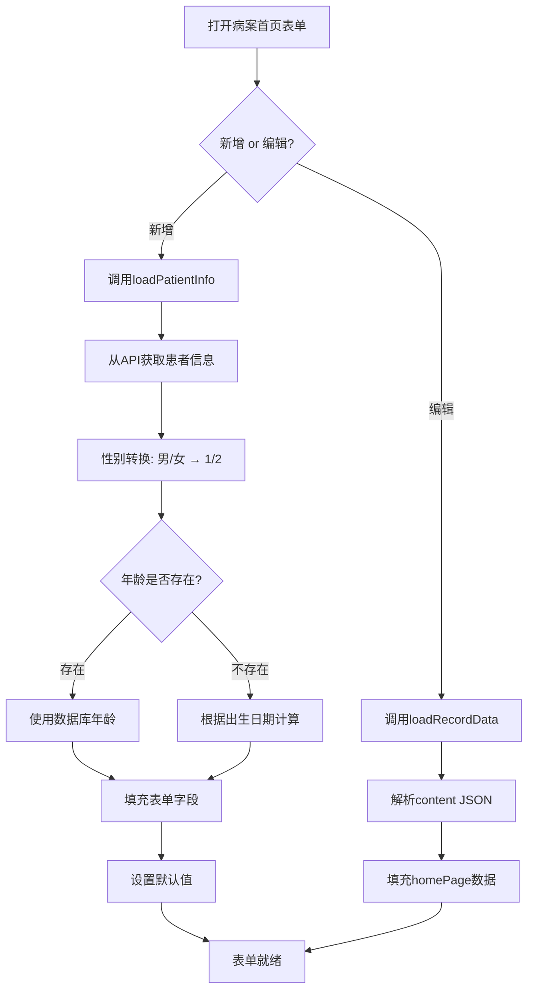

# 病案首页患者信息自动填充功能更新

## 📅 更新日期
2026-06-08

## ✅ 更新内容

### 1. 完善患者信息自动填充

**文件**: `emr-frontend/src/views/inpatient/HomePageForm.vue`

**函数**: `loadPatientInfo(patientId: number)`

#### 自动填充的字段

| 表单字段 | 数据库字段 | 说明 | 是否禁用 |
|---------|-----------|------|---------|
| **姓名** | `name` | 患者姓名 | ✅ disabled |
| **性别** | `gender` | 男/女（自动转换：男→1, 女→2） | ✅ disabled |
| **出生日期** | `birthDate` | 出生日期 | ✅ disabled |
| **年龄** | `age` | 年龄（如未存储则自动计算） | ✅ disabled |
| **身份证号** | `idCard` | 18位身份证号 | ✅ disabled |
| **电话** | `phone` | 联系电话 | ✅ disabled |
| **现住址** | `address` | 家庭住址 | ✅ disabled |
| **住院号** | `inpatientNo` | 住院号 | ✅ disabled |
| **病案号** | `inpatientNo` | 自动等于住院号 | ✅ disabled |
| **入院科室** | `department` | 入院科别 | ❌ 可编辑 |
| **床号** | `bedNo` | 入院床号 |  可编辑 |
| **入院日期** | `admissionDate` | 入院时间 | ❌ 可编辑 |

#### 默认值设置

| 字段 | 默认值 | 说明 |
|------|--------|------|
| `nationality` | '中国' | 国籍 |
| `ethnicity` | '汉族' | 民族 |
| `occupation` | '自由职业' | 职业 |
| `marriage` | '2' | 婚姻（已婚） |

---

### 2. 新增功能特性

#### ✨ 性别自动转换
```typescript
const genderMap: Record<string, string> = {
  '男': '1',
  '女': '2',
}
// 数据库存储：'男'/'女'
// 表单使用：'1'/'2'
```

#### ✨ 年龄自动计算
如果数据库中没有存储年龄，系统会根据出生日期自动计算：
```typescript
if (!age && patient.birthDate) {
  const birthDate = new Date(patient.birthDate)
  const today = new Date()
  let calculatedAge = today.getFullYear() - birthDate.getFullYear()
  const monthDiff = today.getMonth() - birthDate.getMonth()
  if (monthDiff < 0 || (monthDiff === 0 && today.getDate() < birthDate.getDate())) {
    calculatedAge--
  }
  age = String(calculatedAge)
}
```

#### ✨ 调试日志
添加详细的控制台日志，方便调试：
```typescript
console.log('患者信息已自动填充:', {
  name: formData.name,
  gender: formData.gender,
  birthDate: formData.birthDate,
  age: formData.age,
  idCardNo: formData.idCardNo,
  phone: formData.phone,
  presentAddress: formData.presentAddress,
  caseNo: formData.caseNo,
})
```

#### ✨ 错误提示
加载失败时显示用户友好的错误提示：
```typescript
catch (error) {
  console.error('Failed to load patient info:', error)
  ElMessage.error('加载患者信息失败')
}
```

---

### 3. 表单字段禁用更新

以下字段已从**可编辑**改为**禁用**（disabled）：

| 字段 | 修改前 | 修改后 | 原因 |
|------|--------|--------|------|
| 出生日期 | 可编辑 | ❌ disabled | 患者基本信息，不可修改 |
| 身份证号 | 可编辑 | ❌ disabled | 患者唯一标识，不可修改 |
| 现住址 | 可编辑 | ❌ disabled | 患者基本信息，不可修改 |
| 电话 | 可编辑 |  disabled | 患者基本信息，不可修改 |

---

## 🧪 测试场景

### 测试1: 新增病案首页 - 基本信息自动填充

**操作步骤**:
```
1. 住院管理 → 住院患者 → 选择患者"小丽"
2. 点击"病案列表"
3. 点击"新增病案"下拉菜单 → 选择"病案首页"
4. 检查表单自动填充的信息
```

**预期结果**:
- ✅ 姓名：小丽（disabled，灰色显示）
- ✅ 性别：女（disabled，单选框选中"女"）
- ✅ 出生日期：1992-03-15（disabled，日期选择器灰色）
- ✅ 年龄：32（disabled，灰色显示）
- ✅ 身份证号：自动填充（disabled，灰色显示）
- ✅ 电话：自动填充（disabled，灰色显示）
- ✅ 现住址：自动填充（disabled，灰色显示）
- ✅ 病案号：=住院号（disabled，灰色显示）
- ✅ 国籍：中国（默认值）
- ✅ 民族：汉族（默认值）
- ✅ 职业：自由职业（默认值）
- ✅ 婚姻：已婚（默认值）

---

### 测试2: 编辑已有病案首页 - 数据加载

**操作步骤**:
```
1. 病案列表 → 找到病案类型为"病案首页"的记录
2. 点击"编辑"按钮
3. 检查表单数据是否正确加载
```

**预期结果**:
- ✅ 患者基本信息保持disabled状态
- ✅ 已有数据正确填充到表单
- ✅ 可以修改其他字段（住院信息、诊断、手术等）

---

### 测试3: 性别映射验证

**测试数据**:
```
患者A: gender = '男'  →  表单显示：男 (value='1')
患者B: gender = '女'  →  表单显示：女 (value='2')
```

**预期结果**:
- ✅ 性别正确映射
- ✅ 单选框正确选中

---

### 测试4: 年龄计算验证

**测试场景1**: 数据库有年龄
```
患者数据: { age: 32, birthDate: '1992-03-15' }
预期结果: age = '32'（使用数据库值）
```

**测试场景2**: 数据库无年龄
```
患者数据: { age: null, birthDate: '1992-03-15' }
当前日期: 2026-06-08
预期结果: age = '34'（自动计算：2026-1992=34）
```

**测试场景3**: 生日未到
```
患者数据: { age: null, birthDate: '1992-12-20' }
当前日期: 2026-06-08
预期结果: age = '33'（还未过生日，34-1=33）
```

---

### 测试5: 控制台日志验证

**操作步骤**:
```
1. 打开浏览器开发者工具（F12）
2. 切换到Console标签
3. 新增病案首页，选择患者
4. 查看控制台输出
```

**预期结果**:
```
患者信息已自动填充: {
  name: "小丽",
  gender: "2",
  birthDate: "1992-03-15",
  age: "32",
  idCardNo: "110101199203150000",
  phone: "13800138000",
  presentAddress: "北京市朝阳区XX街道XX号",
  caseNo: "ZY20240001"
}
```

---

## 📋 数据映射表

### 患者表 → 病案首页表单

| inpatient_patients 表 | homePage 表单字段 | 转换规则 |
|----------------------|------------------|---------|
| `name` | `name` | 直接映射 |
| `gender` ('男'/'女') | `gender` ('1'/'2') | 性别映射 |
| `birthDate` | `birthDate` | 直接映射 |
| `age` | `age` | 数字转字符串，如无则计算 |
| `idCard` | `idCardNo` | 字段名不同 |
| `phone` | `phone` | 直接映射 |
| `address` | `presentAddress` | 字段名不同 |
| `inpatientNo` | `inpatientNo` | 直接映射 |
| `inpatientNo` | `caseNo` | 病案号=住院号 |
| `department` | `admissionDept` | 字段名不同 |
| `bedNo` | `admissionBed` | 字段名不同 |
| `admissionDate` | `admissionDateTime` | 字段名不同 |

---

## ⚠️ 注意事项

### 1. 字段禁用规则

**严格禁用的字段**（患者基本信息，不可修改）:
- 姓名
- 性别
- 出生日期
- 年龄
- 身份证号
- 电话
- 现住址
- 住院号
- 病案号

**可编辑的字段**（需要手动填写或可修改）:
- 国籍（默认：中国）
- 民族（默认：汉族）
- 职业（默认：自由职业）
- 婚姻（默认：已婚）
- 出生地
- 籍贯
- 所有住院信息
- 所有诊断信息
- 所有手术信息
- 所有医师签名

### 2. 数据一致性

- 病案号始终等于住院号，确保唯一性
- 患者基本信息从患者表获取，保证数据一致性
- 如果患者表数据更新，新建病案时会自动获取最新数据

### 3. 编辑模式

在编辑已有病案时：
- 患者基本信息仍然保持disabled状态
- 从`content.homePage`加载已保存的数据
- 不会重新从患者表加载（避免覆盖已保存的数据）

---

## 🔧 技术实现细节

### 数据加载流程



### 性别转换逻辑

```typescript
const genderMap: Record<string, string> = {
  '男': '1',
  '女': '2',
}

gender: genderMap[patient.gender] || '2'
// 如果数据库是 '男' → 表单值 '1'
// 如果数据库是 '女' → 表单值 '2'
// 如果为空 → 默认 '2'（女）
```

### 年龄计算逻辑

```typescript
let age = patient.age ? String(patient.age) : ''

if (!age && patient.birthDate) {
  const birthDate = new Date(patient.birthDate)
  const today = new Date()
  
  // 年份差
  let calculatedAge = today.getFullYear() - birthDate.getFullYear()
  
  // 月份差调整
  const monthDiff = today.getMonth() - birthDate.getMonth()
  if (monthDiff < 0 || (monthDiff === 0 && today.getDate() < birthDate.getDate())) {
    calculatedAge--  // 还没过生日，减1岁
  }
  
  age = String(calculatedAge)
}
```

---

## 📊 对比：更新前 vs 更新后

| 功能 | 更新前 | 更新后 |
|------|--------|--------|
| **姓名** | ✅ 自动填充 | ✅ 自动填充 |
| **性别** | ✅ 自动填充（未转换） | ✅ 自动填充（正确转换） |
| **出生日期** | ✅ 自动填充 | ✅ 自动填充 + ❌ disabled |
| **年龄** | ✅ 自动填充 | ✅ 自动填充/计算 + ❌ disabled |
| **身份证号** | ❌ 未填充 | ✅ 自动填充 + ❌ disabled |
| **电话** | ❌ 未填充 | ✅ 自动填充 + ❌ disabled |
| **现住址** | ❌ 未填充 | ✅ 自动填充 + ❌ disabled |
| **住院号** | ✅ 自动填充 | ✅ 自动填充 |
| **病案号** | ✅ 自动填充 | ✅ 自动填充 |
| **默认值** |  无 | ✅ 国籍/民族/职业/婚姻 |
| **错误提示** |  无 | ✅ ElMessage.error |
| **调试日志** | ❌ 无 | ✅ console.log |

---

## 🎯 测试检查清单

- [ ] 新增病案首页时，姓名自动填充且disabled
- [ ] 新增病案首页时，性别正确映射（男→1, 女→2）
- [ ] 新增病案首页时，出生日期自动填充且disabled
- [ ] 新增病案首页时，年龄正确显示且disabled
- [ ] 新增病案首页时，身份证号自动填充且disabled
- [ ] 新增病案首页时，电话自动填充且disabled
- [ ] 新增病案首页时，现住址自动填充且disabled
- [ ] 新增病案首页时，病案号等于住院号
- [ ] 新增病案首页时，默认值正确（国籍、民族等）
- [ ] 编辑病案首页时，数据正确加载
- [ ] 编辑病案首页时，患者基本信息保持disabled
- [ ] 控制台显示正确的调试日志
- [ ] 加载失败时显示错误提示
- [ ] 年龄计算逻辑正确（已过生日/未过生日）

---

## 📝 相关文件

- **前端组件**: `emr-frontend/src/views/inpatient/HomePageForm.vue`
- **患者API**: `emr-frontend/src/api/inpatient.ts` → `getInpatientPatient`
- **患者模型**: `emr-backend/src/models/InpatientPatient.ts`
- **患者控制器**: `emr-backend/src/controllers/inpatientController.ts`

---

**更新日期**: 2026-06-08  
**版本**: v1.1  
**状态**: ✅ 已完成
