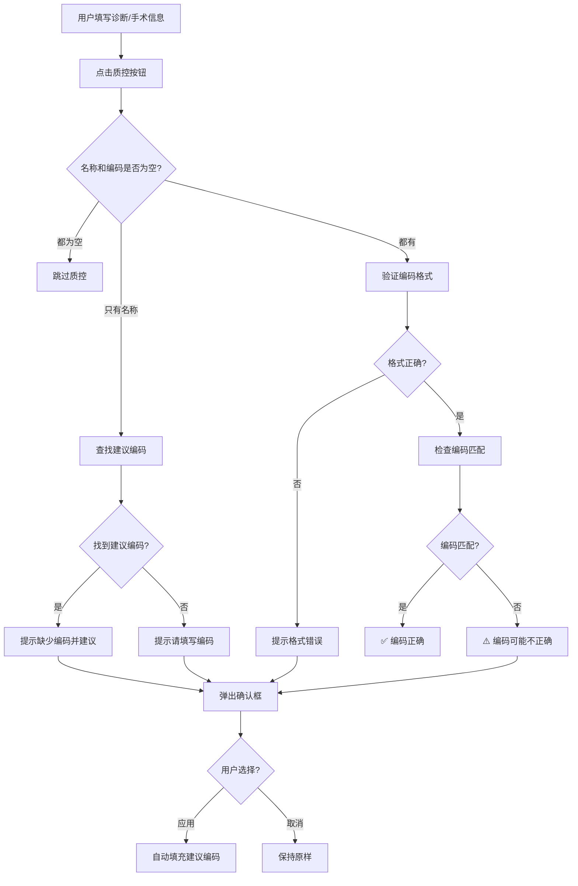

# 病案首页质控功能说明

## 📅 更新日期
2026-06-08

## ✅ 功能概述

在病案首页的**出院诊断**和**手术及操作**模块中新增了**质控列**，提供快速编码验证功能。

### 核心特点

1. **简单快捷**：只需点击"质控"按钮即可检查编码是否正确
2. **智能建议**：编码不正确时，直接给出建议的正确编码
3. **一键应用**：用户可以选择自动填充建议的编码
4. **与教师审核不同**：不需要详细的审核信息，只做编码正确性检查

---

## 🎯 功能详情

### 1. 出院诊断质控

#### 位置
病案首页 → 出院诊断表格 → 质控列

#### 操作步骤
```
1. 填写诊断名称（如：肺炎）
2. 填写疾病编码（如：J18.9）
3. 点击该行的"质控"按钮
4. 系统自动检查编码是否正确
5. 如有错误，显示建议的正确编码
6. 可选择"应用"自动填充建议编码
```

#### 质控内容
- ✅ 检查ICD-10编码格式是否正确
- ✅ 检查编码与诊断名称是否匹配
- ✅ 如果只有名称没有编码，提示建议编码
- ✅ 如果编码格式错误，提示正确格式

#### 示例

**场景1：编码正确**
```
诊断名称：肺炎
疾病编码：J18.9
点击质控 → ✅ 提示："编码正确"
```

**场景2：编码不匹配**
```
诊断名称：肺炎
疾病编码：J20.9（急性支气管炎的编码）
点击质控 → ⚠️ 提示："编码可能不正确，建议使用: J18.9"
       → 弹出确认框询问是否应用建议编码
```

**场景3：缺少编码**
```
诊断名称：2型糖尿病
疾病编码：（空）
点击质控 → ⚠️ 提示："缺少疾病编码，建议使用: E11.9"
       → 弹出确认框询问是否应用建议编码
```

**场景4：编码格式错误**
```
诊断名称：高血压
疾病编码：I100（格式错误）
点击质控 → ⚠️ 提示："编码格式不正确，应为类似 J18.9 的格式"
```

---

### 2. 手术及操作质控

#### 位置
病案首页 → 手术及操作表格 → 质控列

#### 操作步骤
```
1. 填写手术名称（如：阑尾切除术）
2. 填写手术编码（如：47.0）
3. 点击该行的"质控"按钮
4. 系统自动检查编码是否正确
5. 如有错误，显示建议的正确编码
6. 可选择"应用"自动填充建议编码
```

#### 质控内容
- ✅ 检查ICD-9-CM-3编码格式是否正确
- ✅ 检查编码与手术名称是否匹配
- ✅ 如果只有名称没有编码，提示建议编码
- ✅ 如果编码格式错误，提示正确格式

#### 示例

**场景1：编码正确**
```
手术名称：阑尾切除术
手术编码：47.0
点击质控 → ✅ 提示："编码正确"
```

**场景2：编码不匹配**
```
手术名称：胆囊切除术
手术编码：47.0（阑尾切除术的编码）
点击质控 → ⚠️ 提示："编码可能不正确，建议使用: 51.22"
       → 弹出确认框询问是否应用建议编码
```

**场景3：缺少编码**
```
手术名称：冠状动脉搭桥术
手术编码：（空）
点击质控 → ⚠️ 提示："缺少手术编码，建议使用: 36.1"
       → 弹出确认框询问是否应用建议编码
```

**场景4：编码格式错误**
```
手术名称：剖宫产术
手术编码：740（缺少小数点）
点击质控 → ⚠️ 提示："编码格式不正确，应为类似 47.0 的格式"
```

---

## 🔧 技术实现

### 1. 质控工具函数

**文件**: `emr-frontend/src/utils/homePageQualityControl.ts`

#### 主要函数

| 函数名 | 功能 | 参数 | 返回值 |
|--------|------|------|--------|
| `qualityControlDiagnosis` | 质控诊断编码 | diagnosisName, diagnosisCode | QualityControlResult |
| `qualityControlOperation` | 质控手术编码 | operationName, operationCode | QualityControlResult |
| `findCorrectICD10Code` | 查找ICD-10编码 | diseaseName | string \| null |
| `findCorrectICD9CM3Code` | 查找ICD-9-CM-3编码 | operationName | string \| null |
| `validateICD10CodeFormat` | 验证ICD-10格式 | code | boolean |
| `validateICD9CM3CodeFormat` | 验证ICD-9-CM-3格式 | code | boolean |

#### 返回结果类型

```typescript
interface QualityControlResult {
  isValid: boolean      // 是否通过质控
  message: string       // 提示信息
  suggestedCode?: string // 建议的正确编码（可选）
}
```

### 2. 编码数据库

#### ICD-10疾病编码库（部分示例）

```typescript
const ICD10_CODE_DATABASE = {
  'J18.9': '肺炎',
  'J20.9': '急性支气管炎',
  'I10': '原发性高血压',
  'E11.9': '2型糖尿病',
  'K80.2': '胆囊结石',
  'C34.9': '肺癌',
  // ... 更多编码
}
```

#### ICD-9-CM-3手术编码库（部分示例）

```typescript
const ICD9CM3_CODE_DATABASE = {
  '36.1': '冠状动脉搭桥术',
  '47.0': '阑尾切除术',
  '51.22': '胆囊切除术',
  '74.1': '子宫下段剖宫产术',
  '81.54': '全膝关节置换术',
  // ... 更多编码
}
```

### 3. 前端组件集成

**文件**: `emr-frontend/src/views/inpatient/HomePageForm.vue`

#### 新增导入
```typescript
import { ElMessage, ElMessageBox } from 'element-plus'
import { 
  qualityControlDiagnosis as qcDiagnosis, 
  qualityControlOperation as qcOperation 
} from '@/utils/homePageQualityControl'
```

#### 新增函数
```typescript
// 质控诊断编码
const qualityControlDiagnosis = (index: number) => {
  const diagnosis = dischargeDiagnoses.value[index]
  const result = qcDiagnosis(diagnosis.name, diagnosis.code)
  
  if (result.isValid) {
    ElMessage.success(result.message)
  } else {
    ElMessage.warning({ message: result.message, duration: 5000 })
    
    if (result.suggestedCode) {
      ElMessageBox.confirm(
        `是否使用建议的编码：${result.suggestedCode}？`,
        '质控建议',
        { confirmButtonText: '应用', cancelButtonText: '取消', type: 'warning' }
      ).then(() => {
        diagnosis.code = result.suggestedCode!
        ElMessage.success('已自动填充建议编码')
      })
    }
  }
}

// 质控手术编码（类似逻辑）
const qualityControlOperation = (index: number) => { ... }
```

#### 表格列修改

**出院诊断表格**：
```vue
<el-table-column label="质控" width="100" align="center">
  <template #default="{ row, $index }">
    <el-button 
      type="warning" 
      size="small" 
      @click="qualityControlDiagnosis($index)"
    >
      质控
    </el-button>
  </template>
</el-table-column>
```

**手术及操作表格**：
```vue
<el-table-column label="质控" width="100" align="center">
  <template #default="{ row, $index }">
    <el-button 
      type="warning" 
      size="small" 
      @click="qualityControlOperation($index)"
    >
      质控
    </el-button>
  </template>
</el-table-column>
```

---

## 📊 质控流程



---

## 🎨 界面展示

### 出院诊断表格

| 出院诊断 | 疾病编码 | 入院病情 | **质控** | 操作 |
|---------|---------|---------|---------|------|
| 肺炎 | J18.9 | 1.有 | [质控] | [删除] |
| 2型糖尿病 | E11.9 | 1.有 | [质控] | [删除] |
| 高血压 | I10 | 1.有 | [质控] | [删除] |

### 手术及操作表格

| 手术名称 | 手术日期 | 手术级别 | 术者 | I助 | II助 | 切口愈合 | 麻醉方式 | **质控** | 操作 |
|---------|---------|---------|-----|-----|------|---------|---------|---------|------|
| 阑尾切除术 | 2026-06-01 | III | 张医生 | 李医生 | 王医生 | I/甲 | 全身麻醉 | [质控] | [删除] |
| 胆囊切除术 | 2026-06-02 | IV | 赵医生 | 孙医生 | 周医生 | I/乙 | 硬膜外麻醉 | [质控] | [删除] |

---

## ⚙️ 扩展与维护

### 添加新的疾病编码

编辑 `homePageQualityControl.ts` 文件：

```typescript
const ICD10_CODE_DATABASE: Record<string, string> = {
  // 现有编码...
  
  // 新增编码
  '新编码': '疾病名称',
}
```

### 添加新的手术编码

编辑 `homePageQualityControl.ts` 文件：

```typescript
const ICD9CM3_CODE_DATABASE: Record<string, string> = {
  // 现有编码...
  
  // 新增编码
  '新编码': '手术名称',
}
```

### 从后端API获取编码库（未来优化）

当前编码库是前端静态数据，未来可以改为从后端API动态获取：

```typescript
// 伪代码示例
export async function loadICD10Codes() {
  const response = await fetch('/api/icd10-codes')
  return response.json()
}

export async function loadICD9CM3Codes() {
  const response = await fetch('/api/icd9cm3-codes')
  return response.json()
}
```

---

## 📝 注意事项

### 1. 编码数据库限制

- 当前编码库仅包含常见疾病的示例数据
- 实际应用中需要从完整的ICD-10和ICD-9-CM-3数据库导入
- 建议从国家卫健委或医院信息科获取标准编码库

### 2. 模糊匹配规则

- 支持精确匹配（完全相同）
- 支持包含匹配（名称包含或被包含）
- 可能存在多个匹配结果，当前只返回第一个

### 3. 编码格式规范

**ICD-10编码格式**：
- 1个大写字母 + 2位数字 + 可选的小数点 + 1-2位数字
- 示例：`J18.9`, `I10`, `E11.9`, `C34.9`

**ICD-9-CM-3编码格式**：
- 2位数字 + 可选的小数点 + 1-2位数字
- 示例：`47.0`, `51.22`, `36.1`, `74.1`

### 4. 用户体验

- 质控失败时显示警告消息（黄色）
- 质控成功时显示成功消息（绿色）
- 建议编码需要用户确认后才自动填充
- 用户可以选择不应用建议编码

### 5. 与教师审核的区别

| 对比项 | 病案首页质控 | 教师审核质控 |
|-------|------------|------------|
| **目的** | 快速检查编码正确性 | 详细审核病案质量 |
| **内容** | 仅检查编码 | 检查完整性、规范性、逻辑性等 |
| **复杂度** | 简单快捷 | 复杂详细 |
| **反馈** | 直接给出建议编码 | 需要填写详细审核意见 |
| **使用场景** | 医生填写病案时 | 教师/质控员审核时 |

---

## 🧪 测试用例

### 测试1：诊断编码正确
```
输入：诊断名称=肺炎，编码=J18.9
预期：✅ 提示"编码正确"
```

### 测试2：诊断编码错误
```
输入：诊断名称=肺炎，编码=J20.9
预期：⚠️ 提示"编码可能不正确，建议使用: J18.9"
     → 弹出确认框
     → 点击"应用"后编码变为J18.9
```

### 测试3：缺少诊断编码
```
输入：诊断名称=2型糖尿病，编码=空
预期：⚠️ 提示"缺少疾病编码，建议使用: E11.9"
     → 弹出确认框
     → 点击"应用"后编码变为E11.9
```

### 测试4：手术编码正确
```
输入：手术名称=阑尾切除术，编码=47.0
预期：✅ 提示"编码正确"
```

### 测试5：手术编码格式错误
```
输入：手术名称=剖宫产术，编码=740
预期：⚠️ 提示"编码格式不正确，应为类似 47.0 的格式"
```

### 测试6：空数据质控
```
输入：诊断名称=空，编码=空
预期：跳过质控，无提示
```

---

## 📚 相关文档

- [病案首页模块使用说明.md](./病案首页模块使用说明.md)
- [病案首页患者信息自动填充更新说明.md](./病案首页患者信息自动填充更新说明.md)
- [病案首页患者信息加载失败修复报告.md](./病案首页患者信息加载失败修复报告.md)

---

## 🔄 更新日志

### v1.0.0 (2026-06-08)
- ✅ 新增出院诊断质控功能
- ✅ 新增手术及操作质控功能
- ✅ 实现ICD-10编码验证
- ✅ 实现ICD-9-CM-3编码验证
- ✅ 支持智能编码建议
- ✅ 支持一键应用建议编码
- ✅ 创建质控工具函数库

---

## 💡 未来优化方向

1. **完整编码库**：导入完整的ICD-10和ICD-9-CM-3编码数据库
2. **后端API**：从后端动态获取编码库，支持实时更新
3. **批量质控**：支持一次性质控所有诊断和手术记录
4. **历史记录**：记录质控历史，统计常见问题
5. **学习功能**：根据用户选择优化推荐算法
6. **拼音搜索**：支持通过拼音快速查找疾病/手术
7. **常用编码**：根据科室和病种推荐常用编码
8. **离线支持**：缓存编码库，支持离线质控
