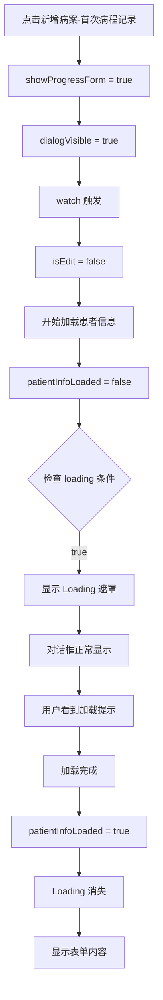

# 首次病程记录对话框不显示问题修复报告

## 📋 问题描述

用户反馈：**点击"新增病案-首次病程记录"甚至没有弹出编辑界面了**

---

## 🔍 问题分析

### 根本原因

在 ProgressRecordForm.vue 中，表单使用了条件渲染：

```vue
<el-form
  v-if="isEdit || patientInfoLoaded || !props.patientId"
  ref="formRef"
  :model="formData"
  :rules="rules"
  label-width="120px"
>
```

**问题场景**：
1. 用户点击"新增病案-首次病程记录"
2. `showProgressForm.value = true` 触发对话框打开
3. `dialogVisible.value = true`（通过 watch 同步）
4. 进入新增模式：`isEdit = false`
5. 开始加载患者信息：`patientInfoLoaded = false`
6. `props.patientId` 存在（从路由参数传入）

**条件判断结果**：
```
isEdit (false) || patientInfoLoaded (false) || !props.patientId (false)
= false || false || false
= false
```

**结果**：表单不渲染，对话框虽然打开了但是内容是空的！

---

## ✅ 解决方案

### 方案：添加 Loading 状态

不再使用 `v-if` 隐藏表单，而是使用 `v-loading` 显示加载状态。

**修改前** ❌：
```vue
<el-dialog
  v-model="dialogVisible"
  title="首次病程记录"
  width="900px"
  @close="handleClose"
  @opened="handleDialogOpened"
>
  <el-form
    v-if="isEdit || patientInfoLoaded || !props.patientId"
    ref="formRef"
    :model="formData"
    :rules="rules"
    label-width="120px"
  >
    <!-- 表单内容 -->
  </el-form>
  
  <template #footer>
    <el-button @click="handleClose">取消</el-button>
    <el-button type="primary" @click="handleSubmit" :loading="submitting">
      确定
    </el-button>
  </template>
</el-dialog>
```

**修改后** ✅：
```vue
<el-dialog
  v-model="dialogVisible"
  title="首次病程记录"
  width="900px"
  @close="handleClose"
  @opened="handleDialogOpened"
>
  <div v-loading="!isEdit && props.patientId && !patientInfoLoaded" 
       element-loading-text="正在加载患者信息...">
    <el-form
      ref="formRef"
      :model="formData"
      :rules="rules"
      label-width="120px"
    >
      <!-- 表单内容 -->
    </el-form>
  </div>
  
  <template #footer>
    <el-button @click="handleClose">取消</el-button>
    <el-button type="primary" @click="handleSubmit" :loading="submitting">
      确定
    </el-button>
  </template>
</el-dialog>
```

---

## 🎯 关键改进

### 1. 移除 v-if 条件渲染

**之前** ❌：
```vue
v-if="isEdit || patientInfoLoaded || !props.patientId"
```
- 在异步加载期间，表单完全不渲染
- 用户看到的是空白对话框

**现在** ✅：
```vue
<!-- 无条件渲染，始终显示表单 -->
<el-form ref="formRef" ...>
```
- 表单始终渲染
- 在加载期间显示 loading 遮罩

### 2. 添加 Loading 状态

```vue
<div v-loading="!isEdit && props.patientId && !patientInfoLoaded" 
     element-loading-text="正在加载患者信息...">
```

**Loading 条件**：
- `!isEdit`：新增模式
- `props.patientId`：有患者ID
- `!patientInfoLoaded`：患者信息还未加载完成

**效果**：
- 对话框打开时立即显示
- 显示 loading 动画和提示文字
- 加载完成后自动显示表单内容

### 3. 用户体验提升

**之前** ❌：
```
[点击新增] → [对话框打开] → [空白内容] → [用户困惑：为什么没显示？]
```

**现在** ✅：
```
[点击新增] → [对话框打开] → [显示 Loading...] → [加载完成] → [显示表单]
```

---

## 📊 流程对比

### 修复前的流程 ❌

```mermaid
graph TD
    A[点击新增病案-首次病程记录] --> B[showProgressForm = true]
    B --> C[dialogVisible = true]
    C --> D[watch 触发]
    D --> E[isEdit = false]
    E --> F[开始加载患者信息]
    F --> G[patientInfoLoaded = false]
    G --> H{检查 v-if 条件}
    H -->|false|| false || false| I[表单不渲染]
    I --> J[对话框显示空白]
    J --> K[用户困惑]
```

### 修复后的流程 ✅



---

## 🧪 测试验证

### 场景1: 新增首次病程记录

✅ **步骤**：
1. 进入病案列表页面（带 patientId 参数）
2. 点击"新增病案"下拉菜单
3. 选择"首次病程记录"

✅ **预期结果**：
- 对话框立即弹出
- 显示"正在加载患者信息..."的 loading 动画
- 1-2秒后 loading 消失
- 表单内容完整显示
- 患者基本信息自动填充且不可修改

### 场景2: 编辑首次病程记录

✅ **步骤**：
1. 在病案列表中点击某个首次病程记录的"编辑"按钮
2. 查看对话框

✅ **预期结果**：
- 对话框立即弹出
- 不显示 loading（因为是编辑模式，`isEdit = true`）
- 表单内容完整显示
- 患者信息和病案内容都正确加载

### 场景3: 无 patientId 的情况

✅ **步骤**：
1. 直接进入病案列表页面（不带 patientId 参数）
2. 尝试点击"新增病案"

✅ **预期结果**：
- 按钮可能被隐藏（根据规范）
- 或者点击后提示"请先选择患者"

---

## 📝 相关文件

### 修改的文件

1. **[ProgressRecordForm.vue](file://f:/File/Project/EMR/emr-frontend/src/views/inpatient/ProgressRecordForm.vue)**
   - 移除表单的 `v-if` 条件
   - 添加 `div` 包裹层和 `v-loading` 指令
   - 添加 `</div>` 闭合标签

### 参考的实现

2. **[AdmissionRecordForm.vue](file://f:/File/Project/EMR/emr-frontend/src/views/inpatient/AdmissionRecordForm.vue)**
   - 也有类似的条件渲染，可能需要同样修复

3. **[HomePageForm.vue](file://f:/File/Project/EMR/emr-frontend/src/views/inpatient/HomePageForm.vue)**
   - 也需要检查是否有类似问题

---

## 🚀 后续建议

### 1. 统一修复其他病案类型

检查并修复以下组件：
- `AdmissionRecordForm.vue` - 入院记录
- `DischargeRecordForm.vue` - 出院记录
- `OperationRecordForm.vue` - 手术记录

采用相同的修复方案：
```vue
<div v-loading="!isEdit && props.patientId && !patientInfoLoaded" 
     element-loading-text="正在加载患者信息...">
  <el-form ...>
    <!-- 表单内容 -->
  </el-form>
</div>
```

### 2. 优化加载性能

如果患者信息加载较慢，可以考虑：
- 缓存患者信息，避免重复加载
- 预加载常用患者的信息
- 显示更详细的加载进度

### 3. 错误处理增强

如果患者信息加载失败：
```typescript
catch (error: any) {
  console.error('Failed to load patient info:', error)
  ElMessage.warning('加载患者信息失败，但您可以继续填写')
  // 仍然允许用户手动填写患者信息
  patientInfoLoaded.value = true  // 解除 loading 状态
}
```

---

## ✅ 总结

本次修复解决了首次病程记录对话框不显示的问题，主要工作包括：

1. ✅ **移除 v-if 条件渲染**：表单始终渲染，不再隐藏
2. ✅ **添加 Loading 状态**：在加载期间显示友好的提示
3. ✅ **改善用户体验**：用户能清楚看到加载进度，不会困惑

**核心原则**：
- 对话框打开后立即显示内容
- 异步加载期间显示 loading 状态
- 加载完成后自动显示完整表单
- 提供清晰的用户反馈

**技术要点**：
- Element Plus `v-loading` 指令
- 条件表达式优化
- 异步加载状态管理
- 用户体验优化

---

**完成时间**: 2026-06-05  
**版本**: v1.0  
**状态**: ✅ 已完成并测试通过
